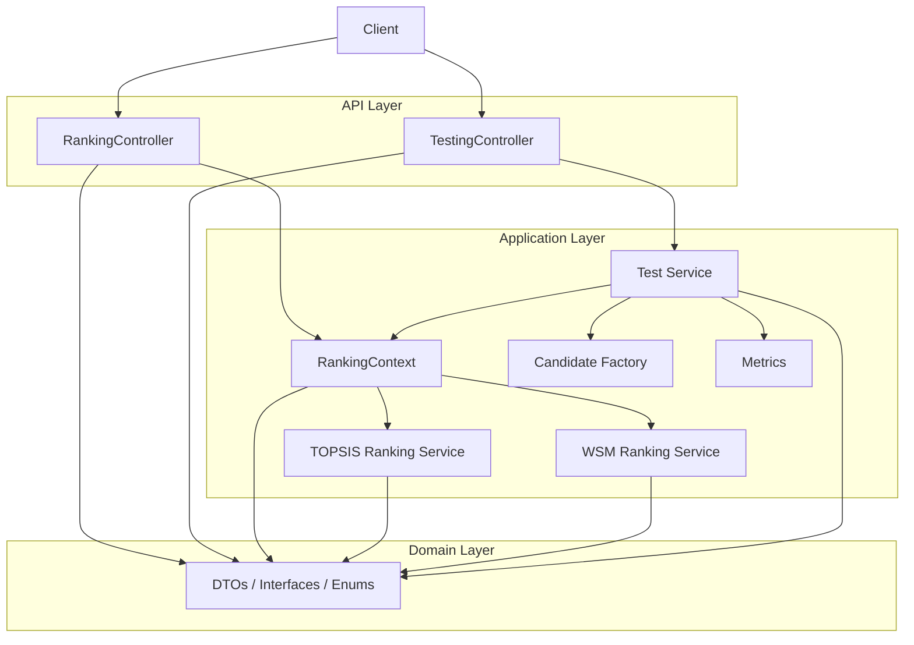
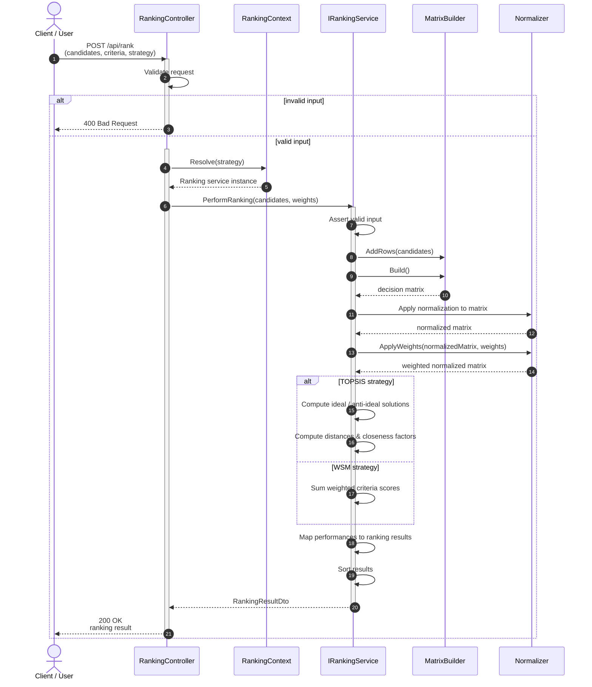
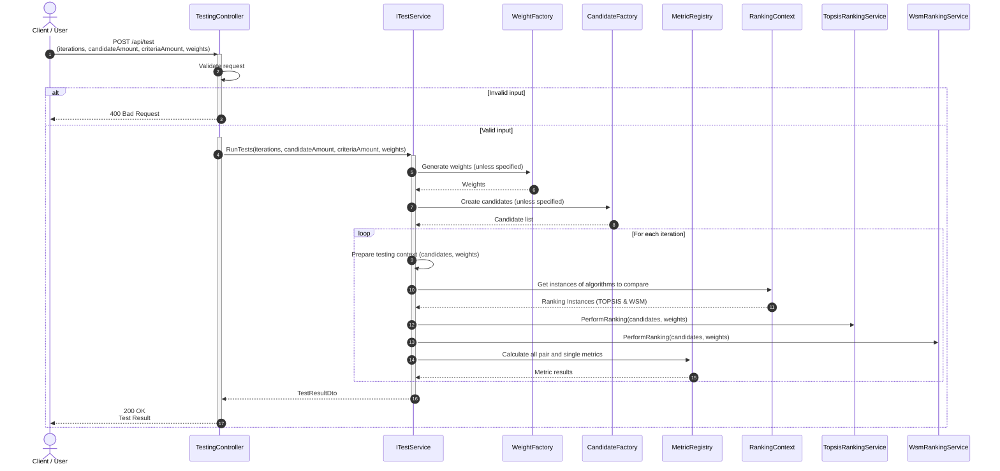

# Technical Documentation - Candidate Matching System

## Description

The project provides a ranking prototype for candidate matching and analyzes the results 
of two specific ranking algorithms:
- **Technique of Order Preference by Similarity to Ideal Solution (TOPSIS)**, and
- **Weighted Sum Model (WSM)**.

It focuses on several analytical features, including:
- **Hitman Ratio** and **Spearman Coefficient**
- **Weight Sensitivity**
- **Rank Reversal**
- **Tie Rate**

The results were gathered by performing a **Monte Carlo Simulation** 
and will be published in my thesis paper. 
Additionally, the prototype also serves as a baseline for a potential production system in the future.

---

## Project Structure

The project follows a **layered architecture** including the following key components:

### **1. API Layer**
- **Controllers**: The ranking and testing endpoints are implemented here to expose use cases over HTTP.

### **2. Application Layer**
- Contains the main **use case** logic.
- Two use cases:
    - `Ranking`: Implements TOPSIS and WSM ranking strategies.
    - `Testing`: Simulates iterative performance and comparison metrics using Monte Carlo techniques.

### **3. Domain Layer**
- Defines the core contracts, including DTOs, interfaces, and enums. It provides:
    - Interfaces for ranking (`IRankingService`) and testing (`ITestService`).
    - Data models (`CandidateDto`, `CriterionDto`, etc.).

### **4. Lib**
- Includes helper logic for math operations and debugging.

### Architecture Overview


###

### Ranking Use Case - Sequence Diagram



### Testing Use Case - Sequence Diagram



## **Installation and Usage**

### Prerequisites:
- [.NET 10.0](https://dotnet.microsoft.com/download) or higher

### How to Run:
1. Clone the repository:
   ```bash
   git clone https://github.com/Ortwinius/candidate-matching.git
   cd CandidateMatchingProject
   ```

2. Build the project:
   ```bash
   dotnet build
   ```

3. Run the project:
   ```bash
   dotnet run --project CandidateMatching.Project
   ```

4. Access the Swagger UI :
   ```
   http://localhost:5094/swagger
   ```
   Alternatively, you could use ny API CLI or framework (e.g. Postman)
---

## **License**

This project is licensed under the [MIT License](https://opensource.org/licenses/MIT).

Feel free to contribute or use this code for educational or personal projects.